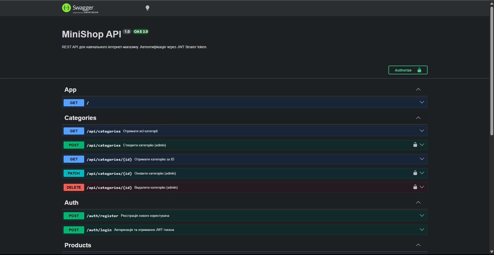

## Student
- Name: Vlad Makhun
- Group: 232.1

## Практичне заняття №6 — Interceptors + Exception Filters + Swagger

### Структура репозиторію

├── src/
│   ├── auth/
│   │   ├── dto/
│   │   │   ├── register.dto.ts
│   │   │   └── login.dto.ts
│   │   ├── auth.module.ts
│   │   ├── auth.service.ts
│   │   └── auth.controller.ts
│   ├── users/
│   │   ├── user.entity.ts
│   │   ├── users.module.ts
│   │   └── users.service.ts
│   ├── categories/
│   ├── products/
│   ├── common/
│   │   ├── enums/
│   │   │   └── role.enum.ts
│   │   ├── guards/
│   │   │   ├── jwt-auth.guard.ts
│   │   │   └── roles.guard.ts
│   │   ├── decorators/
│   │   │   ├── current-user.decorator.ts
│   │   │   └── roles.decorator.ts
│   │   ├── interceptors/
│   │   │   ├── logging.interceptor.ts
│   │   │   └── transform.interceptor.ts
│   │   ├── filters/
│   │   │   └── http-exception.filter.ts
│   │   └── pipes/
│   │       └── trim.pipe.ts
│   ├── migrations/
│   ├── main.ts
│   └── app.module.ts
├── swagger-screenshot.png
├── Dockerfile
├── docker-compose.yml
└── README.md

### Запуск проекту
```bash
cp .env.example .env
docker compose up --build

### Swagger UI
http://localhost:3000/api/docs
 
 


### Формат успішної відповіді

{
  "data": { "id": 1, "name": "iPhone 16", "price": 999.99 },
  "statusCode": 200,
  "timestamp": "2026-04-28T12:00:00.000Z"
}

### Формат помилки 

{
  "error": {
    "code": 400,
    "message": "Validation failed",
    "details": ["name must be longer than 2 characters"],
    "traceId": "a1b2c3d4-e5f6-..."
  },
  "timestamp": "2026-04-28T12:05:00.000Z"
}

### Приклад логів (LoggingInterceptor)

[HTTP] POST /api/products — 201 — 45ms
[HTTP] GET /api/products — 200 — 12ms

### Тест помилки з traceId

GET /api/products/999
Response: 404 Not Found
{
  "statusCode": 404,
  "message": "Product not found",
  "traceId": "b8f9e2c1-3d4a-..."
}


